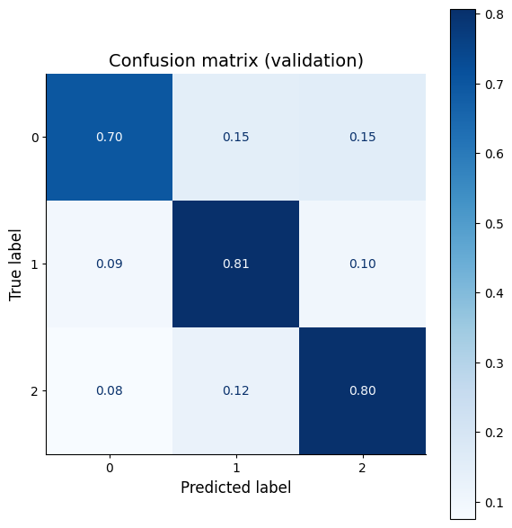
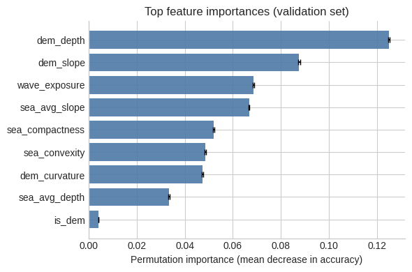

# Substrate (bunntype) model

# Materials and methods

## Study area and analysis grid

The classifier covers the Norwegian coastal zone from the coastline
out to one nautical mile beyond the *grunnlinje* (territorial
baseline). All input layers are reprojected to ETRS89 / UTM zone 33N
(EPSG:25833) and rasterised onto a common 50 m grid, matching the
native resolution of the national marine DEM.

## Data sources

| Purpose                     | Dataset                                              | Provider          | Reference |
|-----------------------------|------------------------------------------------------|-------------------|-----------|
| Depth (raster)              | Dybdedata – terrengmodeller, 50 m grid (DEM50)       | Kartverket        | [Geonorge](https://kartkatalog.geonorge.no/metadata/dybdedata-terrengmodeller-50-meters-grid/67a3a191-49cc-45bc-baf0-eaaf7c513549) |
| Depth bands, intertidal flats and soundings | Sjøkart – dybdedata, layers *Dybdeareal*, *Tørrfall* and *Dybdepunkt* | Kartverket | [Geonorge](https://kartkatalog.geonorge.no/metadata/sjoekart-dybdedata/2751aacf-5472-4850-a208-3532a51c529a) |
| Seabed sediment (labels)    | Bunnsedimenter – kornstørrelse (detaljert)           | NGU               | [Geonorge](https://kartkatalog.geonorge.no/metadata/bunnsedimenter-kornstoerrelse-detaljert/79f0f17d-9f62-456d-b1a9-2a8c754c51c4) |
| Sediment class crosswalk    | *Kornstørrelse – NiN-LM* mapping table               | NGU / MAREANO     | [static.ngu.no](https://static.ngu.no/Mareano/Kornstorrelse-NiN-LM.html) |
| Marine water types (regions)| Ny typologi 2022                                     | Miljødirektoratet | [dataleveranser.miljodirektoratet.no](https://dataleveranser.miljodirektoratet.no/nedlasting/b0fa9d93-dd2d-48fd-a89f-8fa224555c4d/) |
| Wave exposure               | Bølgeeksponeringsmodell (EswmRaster)                 | NIVA              | Isæus (2004); Isæus & Rygg (2005); Bekkby et al. (2025) |

## Target classes

Substrate is aggregated into three classes following the NGU/MAREANO
SOSI ↔ LM-DK crosswalk:

| Code | Class   | LM-DK             |
|------|---------|-------------------|
| 0    | soft    | DK_AB, DK_C, DK_D |
| 1    | mixture | DK_0              |
| 2    | hard    | DK_EFGY           |

Each NGU sediment polygon is assigned to a class by joining its SOSI
grain-size code to its LM-DK group via the crosswalk and mapping LM-DK
to the three-class scheme. The three classes are treated as
independent categories throughout training and evaluation. Detailed
grain-size correspondences are given in Appendix A.

## Predictor features

Each 50 m cell carries nine features:

* **Terrain (DEM-based).** `dem_depth`, `is_dem`, `dem_slope`,
  `dem_curvature`. `dem_depth` is gap-filled from a polygon-based
  depth surface where the DEM is missing; `is_dem` flags whether the
  DEM supplied the value.
* **Depth-polygon shape.** `sea_avg_depth`, `sea_avg_slope`,
  `sea_compactness` (`4π · area / perimeter²`) and `sea_convexity`
  (`area / convex-hull area`).
* **Physical exposure.** `wave_exposure`, resampled to the 50 m grid.

The polygon-based depth surface used both as `sea_avg_depth` and to
fill the DEM combines the *Dybdeareal* depth bands, *Tørrfall*
intertidal flats (assigned depth 0–0.5 m) and measured *Dybdepunkt*
soundings. Construction details are given in Appendix B.

## Model

The production model is an XGBoost gradient-boosted tree classifier,
selected after a preliminary comparison with random forests and
histogram gradient boosting. Class imbalance is handled with balanced
per-sample weights.

To avoid optimistic scores caused by spatial autocorrelation between
neighbouring cells, hyperparameters are tuned by randomised search
under **spatial Leave-One-Region-Out (LORO) cross-validation** using
the Miljødirektoratet marine water-type regions (N, S, M, H, G, B):
each region is held out in turn as the CV test fold. Samples outside
all regions are used only in training. A held-out 20 % of samples,
class-stratified, is reserved for final validation.

Held-out validation performance is reported in the Results section.
Training set construction, hyperparameter search space and software
details are given in Appendix C.

---

# Results

## Model performance

The subsections below describe the model itself: how it was trained,
how well it fits the held-out data, which features drive its
decisions, and how it performs across marine water-type regions and
independent monitoring stations.

### Training data composition

After rasterising the labels and stacking the nine features, valid
training samples span all six Miljødirektoratet marine water-type
regions:

| Region       | B          | G          | H         | M          | N         | S         | unknown |
|--------------|-----------:|-----------:|----------:|-----------:|----------:|----------:|--------:|
| N samples    | 1 187 842  | 1 804 812  | 683 635   | 1 405 867  | 418 167   | 265 407   | 8 268   |

The three-class distribution is imbalanced (mixture is rarest, soft
dominates); balanced class weights are used as per-sample weights
during training:

| Class   | Weight |
|---------|-------:|
| soft    | 0.553  |
| mixture | 2.170  |
| hard    | 1.365  |

### Hyperparameter selection

The XGBoost randomised search under spatial Leave-One-Region-Out
cross-validation selected the following hyperparameters:

| Parameter        | Value    |
|------------------|---------:|
| n_estimators     | 362      |
| max_depth        | 6        |
| learning_rate    | 0.176    |
| subsample        | 0.851    |
| colsample_bytree | 1.00     |
| min_child_weight | 3        |
| gamma            | 0.276    |
| reg_alpha        | 0.163    |
| reg_lambda       | 1.016    |

Search summary scores:

| Metric                        | Value  |
|-------------------------------|-------:|
| Best CV score (LORO)          | 0.5634 |
| CV train score                | 0.7786 |
| Train accuracy                | 0.7416 |
| Validation accuracy           | 0.7395 |
| Overfitting gap (train − val) | 0.0022 |

The gap between the LORO CV score (0.56) and the held-out validation
score (0.74) reflects genuine geographic transfer: within-region
predictions are stronger than predictions in entirely unseen regions.
The near-zero train/validation gap indicates that within a random
split the model does not overfit.

### Held-out validation performance

On the 20 % held-out validation set (n = 1 154 800 cells), overall
accuracy is **0.7395** (853 923 correct predictions).

Per-class report:

| Class        | Precision | Recall | F1     | Support   |
|--------------|----------:|-------:|-------:|----------:|
| soft         | 0.928     | 0.696  | 0.796  | 695 473   |
| mixture      | 0.509     | 0.807  | 0.625  | 177 406   |
| hard         | 0.644     | 0.803  | 0.715  | 281 921   |
| macro avg    | 0.694     | 0.769  | 0.712  | 1 154 800 |
| weighted avg | 0.794     | 0.739  | 0.750  | 1 154 800 |

Confusion matrix (rows = true, columns = predicted):

|         | soft    | mixture | hard    |
|---------|--------:|--------:|--------:|
| soft    | 484 279 | 103 640 | 107 554 |
| mixture |  16 502 | 143 196 |  17 708 |
| hard    |  21 151 |  34 322 | 226 448 |

The model is highly precise for soft (0.93) but under-recalls it
(0.70), redistributing some true soft cells into the mixture class
and, more rarely, into hard. Hard recall is 0.80. Mixture has the
lowest precision (0.51) because it sits between the two dominant
classes and absorbs boundary cells.

### Feature importance

Permutation importance on the held-out validation set:

| Feature         | Mean importance | Std      |
|-----------------|----------------:|---------:|
| dem_depth       | 0.1249          | 0.00039  |
| dem_slope       | 0.0875          | 0.00035  |
| wave_exposure   | 0.0685          | 0.00027  |
| sea_avg_slope   | 0.0667          | 0.00024  |
| sea_compactness | 0.0520          | 0.00023  |
| sea_convexity   | 0.0485          | 0.00017  |
| dem_curvature   | 0.0474          | 0.00022  |
| sea_avg_depth   | 0.0335          | 0.00025  |
| is_dem          | 0.0040          | 0.00003  |

Depth is the dominant predictor, followed by DEM slope and wave
exposure. The polygon-based shape descriptors (`sea_avg_slope`,
`sea_compactness`, `sea_convexity`) each contribute measurable
information. The `is_dem` indicator carries almost no importance,
indicating that the DEM-versus-polygon origin of the depth value does
not meaningfully change the model's decisions.

### Regional performance

Break-down of held-out validation accuracy by marine water-type
region:

| Region  | n samples | Accuracy |
|---------|----------:|---------:|
| B       | 237 623   | 0.807    |
| G       | 360 869   | 0.715    |
| H       | 136 658   | 0.711    |
| M       | 280 829   | 0.735    |
| N       |  83 763   | 0.692    |
| S       |  53 409   | 0.778    |
| unknown |   1 649   | 0.747    |

Region B has the highest accuracy (0.81) and Region N the lowest
(0.69). The Møre area (region M) sits close to the national mean at
0.74 but its errors are the most polarised (see external validation
below).

### External validation against monitoring stations

The predicted substrate map was compared against independent NIVA
Aquamonitor monitoring stations, retrieved as WFS layers from the
Terria map viewer. Each station was intersected with the predicted
substrate polygons and aggregated through the LM-DK groupings
(`DK_AB, DK_C, DK_D` → soft, `DK_0` → mixture, `DK_EFGY` → hard).
Stations falling outside all polygons are reported separately.

Because the monitoring stations only carry a binary field label
(soft-bottom or hard-bottom), a `mixture` prediction is neither a
clean hit nor a clean miss. It is reported as a partial match and
excluded from the exact-match rate; the opposite-class column
captures the true errors.

**Soft-bottom monitoring stations** — of 1 467 stations, 1 393 fell
inside a predicted polygon:

| Predicted class | n   | % of stations inside a polygon |
|-----------------|----:|-------------------------------:|
| soft (match)    | 930 | 66.8 %                         |
| mixture (partial) | 228 | 16.4 %                       |
| hard (opposite) | 235 | 16.9 %                         |

**Hard-bottom monitoring stations** — of 280 stations, 185 fell
inside a predicted polygon:

| Predicted class | n   | % of stations inside a polygon |
|-----------------|----:|-------------------------------:|
| hard (match)    | 143 | 77.3 %                         |
| mixture (partial) |  24 | 13.0 %                       |
| soft (opposite) |  18 |  9.7 %                         |

At the reference monitoring stations the model reproduces the field
class in ≈ 67 % of the soft sites and ≈ 77 % of the hard sites inside
a predicted polygon. The opposite-class error rate is ≈ 17 % at soft
sites and ≈ 10 % at hard sites; the remainder is classified as the
intermediate `mixture` class.

## Physical interpretation

Once the model has been validated, its predictions can be combined
with the same NGU sediment observations that supplied the training
labels to produce national- and regional-scale summaries of the
Norwegian coastal seabed. The predicted substrate map for the study
area is shown below; the coastal-shelf accounting that follows
quantifies its composition.

### Coastal-shelf area accounting

Substrate area distribution over the shallow coastal shelf
(depth ≥ −30 m from mean sea level), by økoregion, using the DEM50
depth mask and the predicted substrate polygons rasterised at 50 m.
Where NGU BunnsedimentKornstorDetalj observations overlap the shelf
they replace the model prediction, so the accounting is a hybrid of
in-situ observations (used as ground truth in training) and the
model output elsewhere. The three classes correspond to the LM-DK
groupings `DK_AB, DK_C, DK_D` → soft, `DK_0` → mixture,
`DK_EFGY` → hard:

| Region       | Total ≥ −30 m (km²) | soft (km²) | mixture (km²) | hard (km²) | soft % | mix % | hard % |
|--------------|--------------------:|-----------:|--------------:|-----------:|-------:|------:|-------:|
| Norskehavet  | 11 882.9            | 3 024.5    | 2 353.7       | 6 495.6    | 25.5   | 19.8  | 54.7   |
| Skagerrak    |  1 292.1            |   474.6    |   194.7       |   618.8    | 36.7   | 15.1  | 47.9   |
| Nordsjøen    |  1 927.8            |   362.1    |   225.4       | 1 336.3    | 18.8   | 11.7  | 69.3   |
| Barentshavet |  1 797.2            |   526.4    |   589.3       |   680.4    | 29.3   | 32.8  | 37.9   |
| Norge (sum)  | 16 900.1            | 4 387.6    | 3 363.1       | 9 131.1    | 26.0   | 19.9  | 54.0   |

Row percentages do not sum to exactly 100 because a small fraction
of the depth mask falls outside any predicted polygon.

At national level, roughly a quarter of the shallow (≥ −30 m) shelf
is soft, a fifth mixture, and just over half hard. Composition is
strongly region-dependent: Nordsjøen is hard-dominated (≈ 69 %),
Barentshavet has the largest mixture share (≈ 33 %) and a nearly
balanced soft/hard split, and Norskehavet is close to the national
mean.

### Substrate composition of the intertidal (Tørrfall) zone

Overlaying the Tørrfall polygons (Kartverket sjøkart) with the
predicted substrate map gives the following breakdown of the
intertidal zone by predicted class:

| Class          | Area (km²) | % of Tørrfall |
|----------------|-----------:|--------------:|
| soft           |     448.2  |         23.2  |
| mixture        |     572.5  |         29.6  |
| hard           |     875.4  |         45.3  |
| no prediction  |      36.8  |          1.9  |
| **total**      | **1 933.0**| **100.0**     |

Of the 1 933 km² of Tørrfall, 45 % is predicted as hard, 30 % as
mixture and 23 % as soft; 2 % falls outside any predicted polygon.

## Summary

* Overall held-out pixel accuracy is 0.74. Per-class F1 is 0.80
  (soft), 0.62 (mixture) and 0.71 (hard). Mixture has the lowest
  precision because it absorbs boundary cells between the two
  dominant classes.
* Depth is the dominant feature, followed by DEM slope and wave
  exposure. Polygon shape descriptors add measurable information; the
  DEM-vs-polygon origin flag does not.
* Regional accuracy ranges from 0.69 (region N) to 0.81 (region B).
* Independent NIVA Aquamonitor stations reproduce the predicted class
  at 67 % (soft) and 77 % (hard) of stations inside a predicted
  polygon, with an opposite-class error rate of 17 % and 10 %
  respectively; the remainder is classified as the intermediate
  `mixture` class.
* At national level, the shallow (≥ −30 m) coastal shelf is estimated
  to comprise ≈ 4 390 km² soft, ≈ 3 360 km² mixture and ≈ 9 130 km²
  hard substrate, with strong regional contrast: Nordsjøen is
  hard-dominated, Barentshavet has the largest mixture share. Where
  NGU sediment observations overlap the shelf, they are used in place
  of the model prediction.
* Of the intertidal Tørrfall zone (≈ 1 930 km² nationally), 45 % is
  predicted as hard, 30 % as mixture and 23 % as soft.

# Appendices

## Appendix A — SOSI grain-size correspondences

Representative SOSI grain-size names for each LM-DK group used in the
labelling, taken from the
[NGU/MAREANO SOSI ↔ LM-DK crosswalk](https://static.ngu.no/Mareano/Kornstorrelse-NiN-LM.html):

| Seabed class       | LM-DK    | Representative SOSI grain-size names                                                                                        |
|--------------------|----------|-----------------------------------------------------------------------------------------------------------------------------|
| soft               | DK_AB    | Leir, Slam, Silt, Sandholdig slam, Slamholdig sand, Grusholdig slam, …                                                       |
| soft               | DK_C     | Sand, Fin sand, Grov sand, Slamholdig sand, Siltholdig sand, Leirholdig sand, Grusholdig sand, …                             |
| soft               | DK_D     | Grus, Sandholdig grus, Slamholdig grus, Grus og stein, "Grus, stein og blokk"                                                |
| mixture            | DK_0     | Sand, grus og stein; Sand og blokk; Slam/sand med stein/blokk; Stein/blokk med sand-/slamdekke; Biogent materiale (korall)   |
| hard               | DK_EFGY  | Stein og blokk; Bart fjell; Tynt/usammenhengende sedimentdekke over berggrunn; Harde sedimenter eller sedimentære bergarter  |

## Appendix B — Depth surface construction and DEM gap-filling

Depth is the dominant predictor and combines the DEM50 raster, which
is dense offshore but has extensive coastal gaps, with the sjøkart
depth-band polygons.

The *Dybdeareal* polygons carry a minimum and maximum charted depth
(`minimumsdybde`, `maksimumsdybde`). *Tørrfall* intertidal-flat
polygons are treated as an additional depth band with range 0–0.5 m
so that they contribute the shallowest edge of the bathymetry.

A continuous depth surface is derived from the polygons as follows:

1. For each polygon, a *shallow* and a *deep* reference edge are
   detected as the pixels adjacent to a neighbouring polygon whose
   maximum (respectively minimum) charted depth matches this
   polygon's minimum (maximum) charted depth. These are the shared
   iso-depth contours with the neighbouring bands.
2. Depth is interpolated linearly between the two edges using the
   Euclidean distance transform, so that a cell at fractional distance
   `t` from the shallow edge receives `min_d + (max_d − min_d) · t`.
3. Polygons without a matching neighbour on one or both sides fall
   back to their own outer boundary; if both are absent the polygon
   degrades to its midpoint depth.
4. Wide-range polygons (charted range ≥ 150 m with a minimum depth
   essentially at the shore) are refined by fitting a thin-plate-spline
   RBF interpolator to the *Dybdepunkt* soundings that fall inside the
   polygon when at least five soundings are available, clipped to the
   charted range.
5. A narrow Gaussian blend (σ ≈ 75 m) is applied in a one-pixel band
   around every polygon boundary to remove step discontinuities that
   would otherwise inflate the derived slope feature.

DEM50 and this surface are then fused: `dem_depth` uses the DEM where
present and the interpolated depth where the DEM is missing; `is_dem`
records which source supplied the value; `dem_slope` uses the DEM
slope, falling back to the slope of the interpolated raster and then
to the polygon-average slope; `dem_curvature` uses the DEM curvature
with a flat default (0) elsewhere. The final training and prediction
mask keeps only cells with a substrate label and finite values in all
nine features.

## Appendix C — Training set, hyperparameter search and software

Training samples are individual valid 50 m cells with the nine-feature
vector and the rasterised substrate class. Class weights are computed
as `n_samples / (n_classes · n_c)` (balanced) to compensate for the
under-representation of *fastbunn* and are passed as per-sample
weights.

Every sample is tagged with the Miljødirektoratet marine water-type
*Region* by a spatial join with the dissolved *Ny typologi 2022*
polygons; samples outside all regions are tagged `unknown` and are
used only for training. The dataset is split 80 / 20 into a training
set and a held-out validation set (class-stratified, fixed random
seed).

XGBoost is used with the histogram tree method, multi-class log-loss
objective and early stopping on the held-out validation set.
Hyperparameters are tuned by randomised search over the number of
trees, tree depth, learning rate, row and column subsampling, minimum
child weight, gamma and L1/L2 regularisation. When a previous best
parameter set is stored, the search is narrowed to a ±30 % window
around it; otherwise the wide default ranges are used. Cross-validation
inside the search uses spatial Leave-One-Region-Out; the routine falls
back to stratified K-fold when region information is unavailable. The
best estimator is refitted on the full training set.

Processing uses Python with `geopandas`, `rasterio`, `xdem`,
`geoutils`, `scipy`, `numpy`, `scikit-learn` and `xgboost`. Random
seeds are fixed in the train/validation split, the balanced-class
weight computation and the hyperparameter search.

